# SyncTube

SyncTube is a real-time YouTube watch-party app. Create a room, invite friends, and watch together with synchronized playback, chat, reactions, and a shared playlist.

## Screenshots

The screenshots below show the app at phone, tablet, and desktop sizes. Room images use the empty-player state so the room layout and controls remain visible.

### Home page

| Phone · 390 × 844 | Tablet · 834 × 1112 | Desktop · 1440 × 900 |
|---|---|---|
| 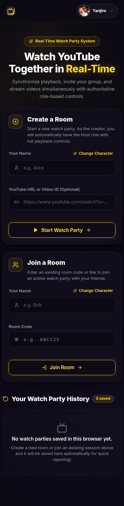 | 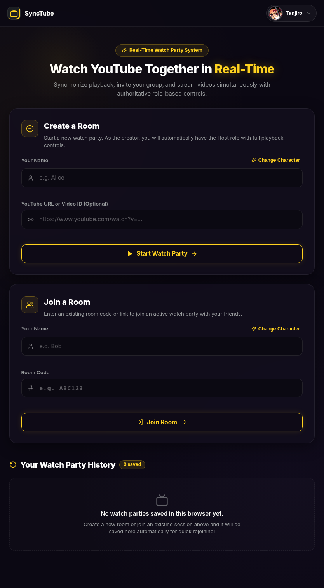 | 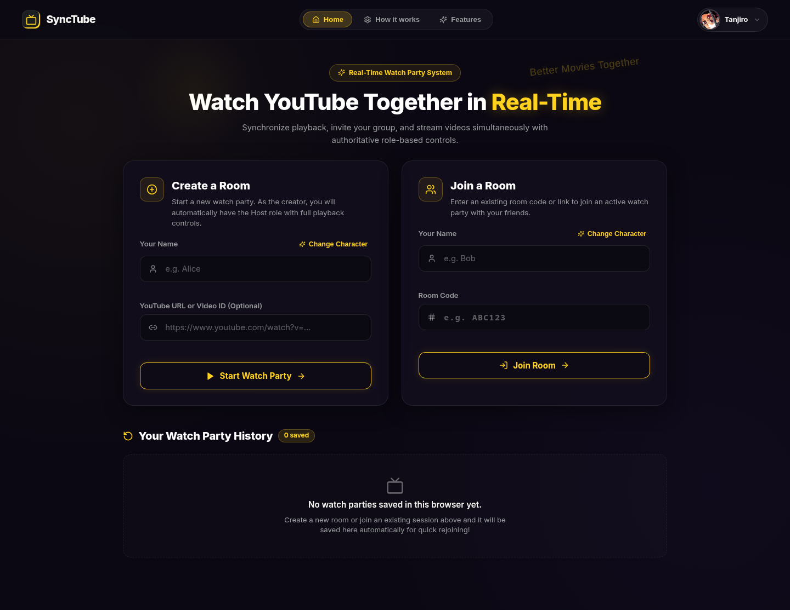 |

### Home page guides

| How it works | Feature overview |
|---|---|
| 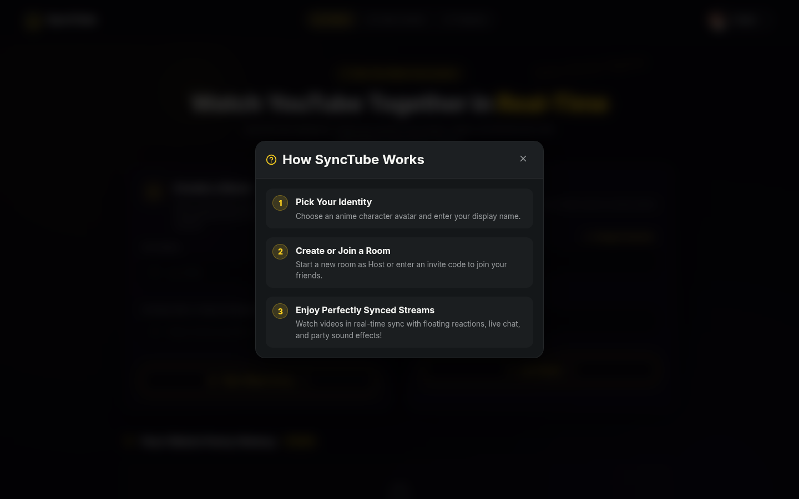 |  |

### Watch room

| Phone · 390 × 844 | Tablet · 834 × 1112 | Desktop · 1440 × 900 |
|---|---|---|
| 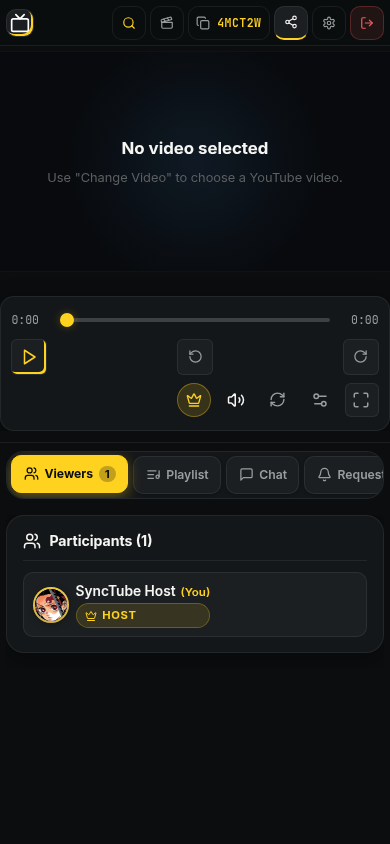 | 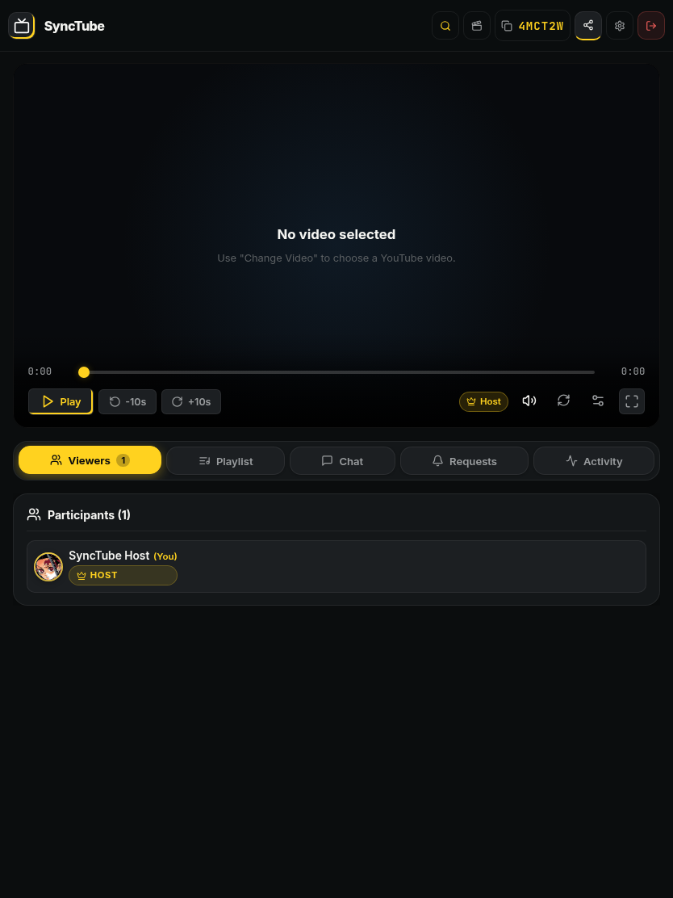 |  |

### Room tabs and activity

| Participants | Playlist | Chat |
|---|---|---|
| 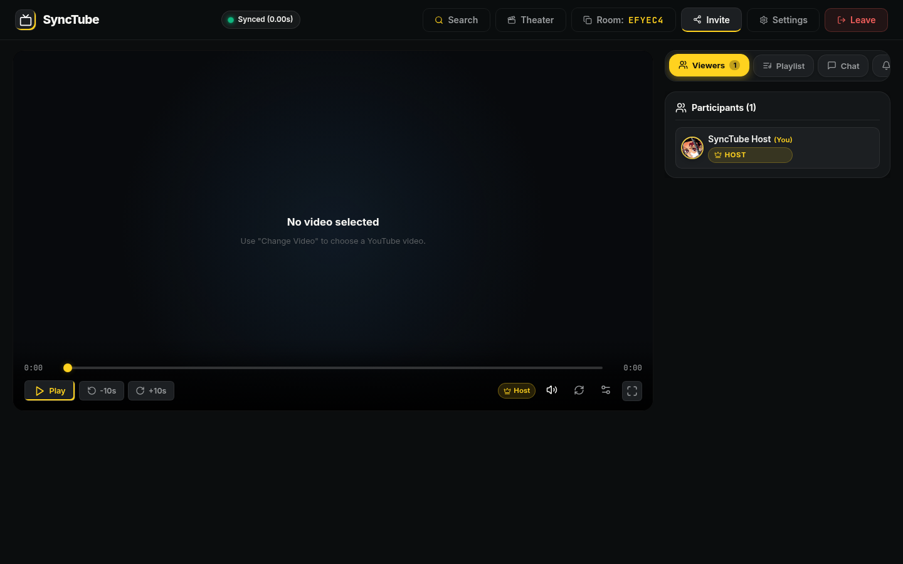 |  |  |

| Action requests | Activity |
|---|---|
| 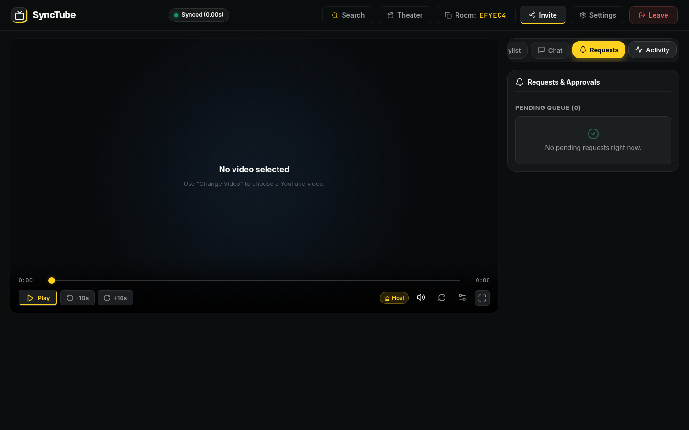 | 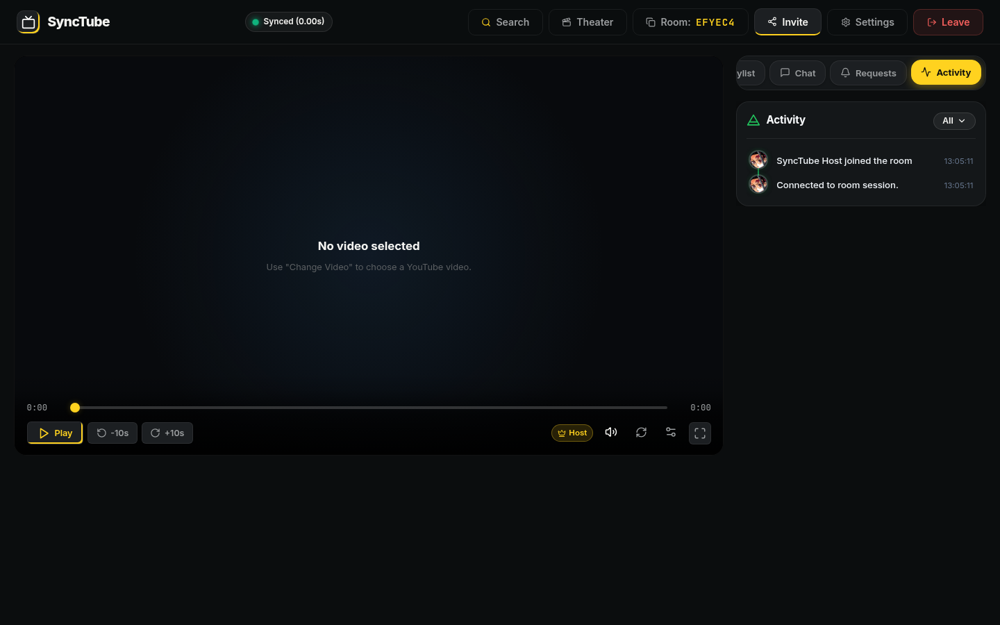 |

### Search, invitations, and settings

| YouTube search | Invite friends |
|---|---|
| 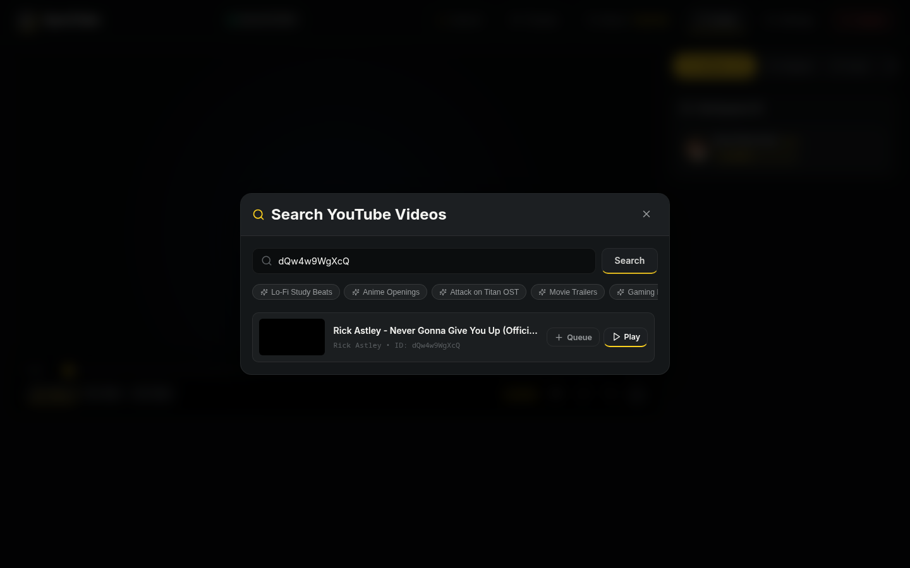 | 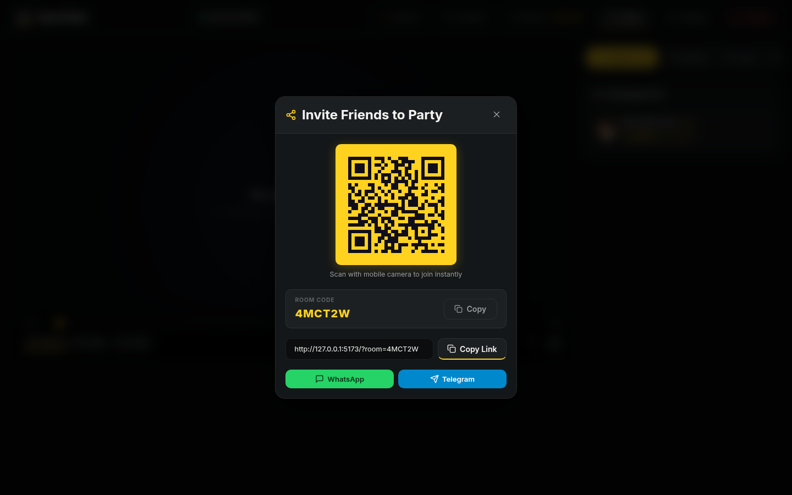 |

| User settings | Room settings |
|---|---|
| 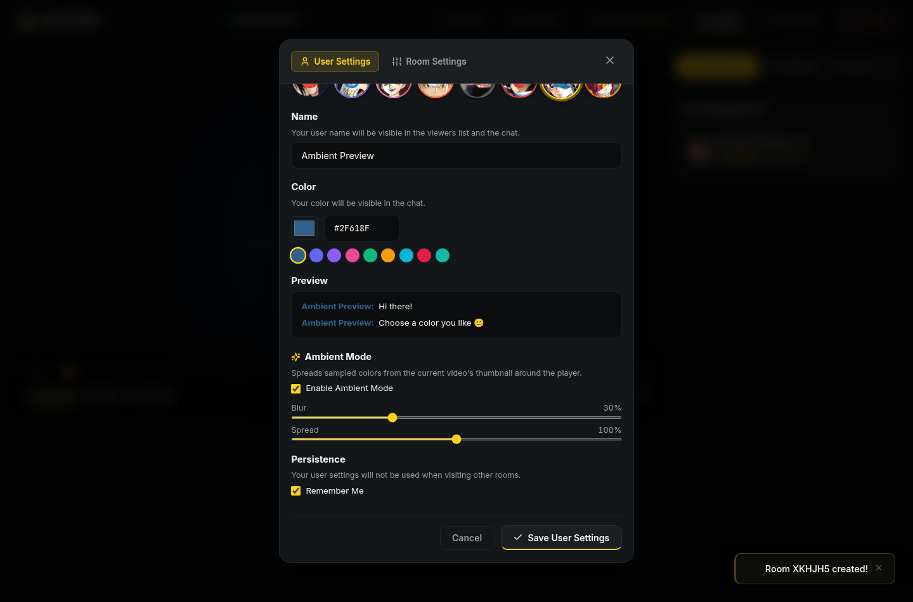 |  |

The invite screenshot shows a sample room code and development link. Create an invite in the live app to get a link for your own room.

## Deployment

The app has a React/Vite frontend hosted on Vercel and an Express/Socket.IO backend hosted on Render. The root [`vercel.json`](./vercel.json) builds the frontend and forwards API and Socket.IO requests to the Render service. [`render.yaml`](./render.yaml) defines the backend service.

### Render

1. In Render, create a **Blueprint** from this GitHub repository and select `render.yaml`.
2. Set `FRONTEND_URL` to the deployed Vercel site URL.
3. Optionally set `DATABASE_URL` to a PostgreSQL connection string. Without it, room state is held in memory and is lost when the server restarts.
4. Deploy the service and confirm its `/health` endpoint responds.

### Vercel

1. Import this GitHub repository into Vercel.
2. Keep the project root at the repository root so Vercel uses `vercel.json`.
3. Deploy after the Render backend is available. The rewrite destinations in `vercel.json` must point to the public Render service URL.

Both hosting services can be configured to deploy from the `main` branch.

## Local development

Requirements: Node.js and npm.

```sh
npm ci
npm run dev
```

Build both apps with `npm run build`. Run the test suites with `npm test`.

## Data and configuration

The server uses PostgreSQL through the optional `DATABASE_URL` setting to persist basic room playback metadata. Without a database, rooms run in memory. Chat, playlists, polls, reactions, and participant presence are also in-memory and are not durable across server restarts. Browser settings and recent-room history are stored locally in the user's browser.

Do not commit `.env` files, database connection strings, or other secrets. Production environment variables should be set in the Render or Vercel project settings as appropriate.
